# SIESIF - Sistema Experto para la Selección de Inversiones Financieras


## 📋 Descripción

**SIESIF** (Sistema Experto para la Selección de Inversiones Financieras) es una aplicación web inteligente basada en programación lógica. Su función principal es actuar como un asesor financiero digital, proporcionando recomendaciones personalizadas de instrumentos de inversión del mercado mexicano.

El sistema utiliza un **Motor de Inferencia** que analiza tres variables fundamentales del usuario a través de un cuestionario validado:
1. **Perfil de riesgo** (Conservador, Moderado, Agresivo).
2. **Horizonte temporal** de la inversión (Corto, Mediano, Largo plazo).
3. **Capacidad económica** y tolerancia a la volatilidad.

## 🎯 Objetivo

Democratizar el acceso a la asesoría financiera mediante un sistema objetivo, consistente y disponible 24/7 que ayude a inversionistas novatos a tomar decisiones fundamentadas sin la necesidad de un asesor humano costoso.

---

## 🏗️ Arquitectura del Sistema

El sistema sigue una arquitectura **Cliente-Servidor** desacoplada, comunicándose a través de una API RESTful.

### Stack Tecnológico

* **Backend (Lógica & API):**
  * Lenguaje: **Python 3.11+**
  * Framework Web: **Flask**
  * ORM: **SQLAlchemy**
  * Servidor WSGI: **Gunicorn** (Producción)
* **Base de Datos:**
  * Desarrollo: **SQLite**
  * Producción: **PostgreSQL** (Compatible)
* **Frontend (Interfaz):**
  * Estructura: **HTML5**
  * Estilos: **CSS3** (Metodología BEM y utilidades custom)
  * Lógica Cliente: **JavaScript** (Vanilla ES6+, Fetch API)

### Diagrama de Flujo de Datos

```mermaid
graph LR
    A[Usuario] -->|Llena Cuestionario| B(Frontend JS)
    B -->|JSON Request| C{API Flask}
    C -->|Datos| D[Motor de Inferencia]
    D -->|Perfil Calculado| E[Reglas Lógicas]
    E -->|Consulta SQL| F[(Base de Datos)]
    F -->|Instrumentos| E
    E -->|Recomendaciones| C
    C -->|JSON Response| B
    B -->|Renderiza| A
```


## 📂 Estructura del Proyecto
```
SIESIF/
│
├── backend/                # Código fuente del Servidor
│   ├── app.py              # Punto de entrada y rutas API
│   ├── config.py           # Configuración de entorno
│   ├── models.py           # Modelos de Base de Datos (ORM)
│   ├── motor_inferencia.py # Cálculo de puntajes y perfiles
│   └── reglas_logicas.py   # Selección de instrumentos
│
├── frontend/               # Código fuente del Cliente
│   ├── index.html          # Landing Page
│   ├── cuestionario.html   # Formulario de 13 preguntas
│   ├── puntaje.html        # Visualización de resultados
│   ├── css/                # Hojas de estilo
│   └── js/                 # Lógica de conexión con API
│
├── database/               # Scripts SQL
│   └── seed_data.sql       # Datos iniciales (11 instrumentos)
│
├── requirements.txt        # Dependencias de Python
└── README.md               # Documentación
```

## 🚀 Instalación y Configuración Local

Sigue estos pasos para ejecutar el proyecto en tu computadora:

### 1. Prerrequisitos

* Python 3.11 o superior instalado.
* Git instalado.

### 2. Clonar el Repositorio
```bash
git clone https://github.com/tu-usuario/SIESIF.git
cd SIESIF
```

### 3. Configurar Entorno Virtual

Es crucial usar un entorno virtual para aislar las dependencias.

**Windows:**
```bash
python -m venv venv
.\venv\Scripts\activate
```

**Mac/Linux:**
```bash
python3 -m venv venv
source venv/bin/activate
```

### 4. Instalar Dependencias
```bash
pip install -r requirements.txt
```

### 5. Configurar Variables de Entorno

Crea un archivo `.env` en la raíz del proyecto (opcional para desarrollo local, Flask usará SQLite por defecto si no existe).

### 6. Ejecutar la Aplicación
```bash
cd backend
python app.py
```

El servidor iniciará en `http://127.0.0.1:5000`.

La base de datos se creará y poblará automáticamente si está vacía.

## 🔌 Documentación de la API

El backend expone los siguientes endpoints JSON:

### 1. Obtener Catálogo de Instrumentos

**Endpoint:** `GET /api/instrumentos`

**Descripción:** Retorna la lista completa de los 11 instrumentos financieros disponibles.

**Respuesta:**
```json
{
  "total": 11,
  "instrumentos": [
    { "nombre": "CETES", "riesgo": "bajo", "tipo": "renta_fija", ... },
    ...
  ]
}
```

### 2. Evaluar Perfil

**Endpoint:** `POST /api/evaluar-perfil`

**Descripción:** Recibe las respuestas del cuestionario, calcula el perfil y devuelve recomendaciones filtradas.

**Body (JSON):**
```json
{
  "respuestas": {
    "p1": 1, "p2": 3, "p3": 2, ... "p13": 1
  }
}
```

**Respuesta:**
```json
{
  "puntaje": 35,
  "perfil": "moderado",
  "recomendaciones": [ ...lista de instrumentos... ]
}
```

## 📊 Instrumentos Financieros Incluidos

El sistema cuenta con una base de conocimiento de 11 instrumentos clave del mercado mexicano:

| Instrumento    | Tipo            | Riesgo      |
|----------------|-----------------|-------------|
| CETES          | Renta Fija      | Bajo        |
| Bonos M        | Renta Fija      | Bajo-Medio  |
| Udibonos       | Renta Fija      | Bajo        |
| Bondes F       | Renta Fija      | Bajo        |
| Bonos IPAB     | Renta Fija      | Bajo        |
| Fondos Deuda   | Renta Fija      | Bajo-Medio  |
| Fondos Mixtos  | Mixto           | Medio       |
| ETFs           | Mixto           | Medio       |
| FIBRAs         | Alternativo     | Medio       |
| Acciones       | Renta Variable  | Alto        |
| Fondos RV      | Renta Variable  | Alto        |

## 👥 Equipo de Desarrollo

Proyecto desarrollado por estudiantes del Instituto Tecnológico Nacional de México - Campus Celaya.

* **Omar Gadiel Bolaños García** - Coordinador, Arquitectura Backend & DevOps.
* **Gael González Cruz** - Base de Datos & Modelado de Datos.
* **Diego Emilio Ortiz Vílchez** - Frontend, UI/UX & Diseño Web.
* **Brian García Mares** - Base de Conocimiento & Motor de Inferencia.
* **Christian Raúl Paramo Bautista** - Lógica de Negocio & Reglas del Sistema.


Puedes probar el proyecto con su Deploy en el siguiente enlace


## 📄 Licencia

Este proyecto está bajo la Licencia MIT - ver el archivo LICENSE para más detalles.
